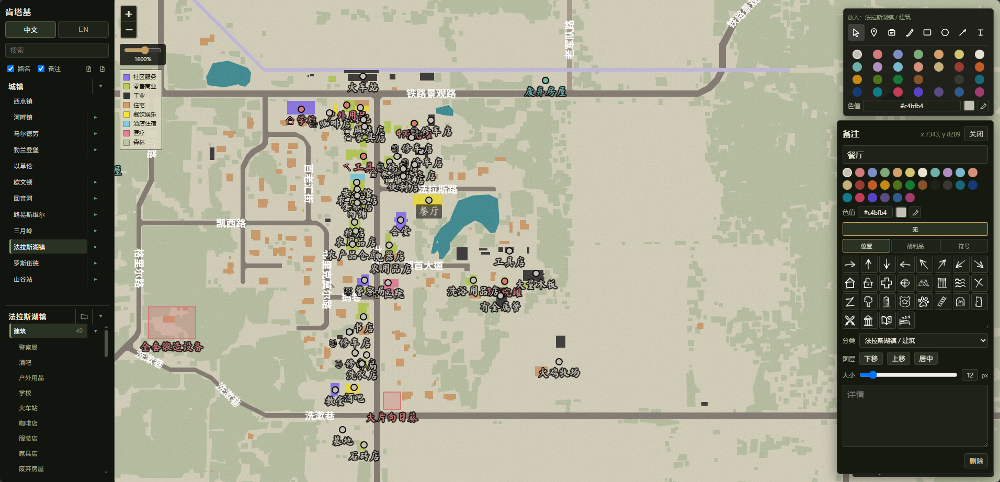
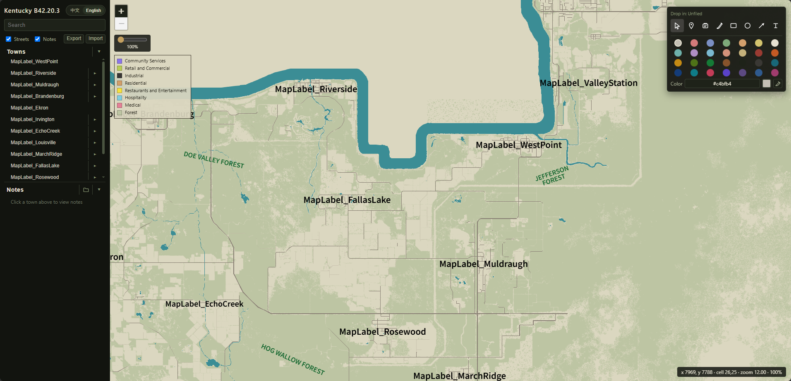
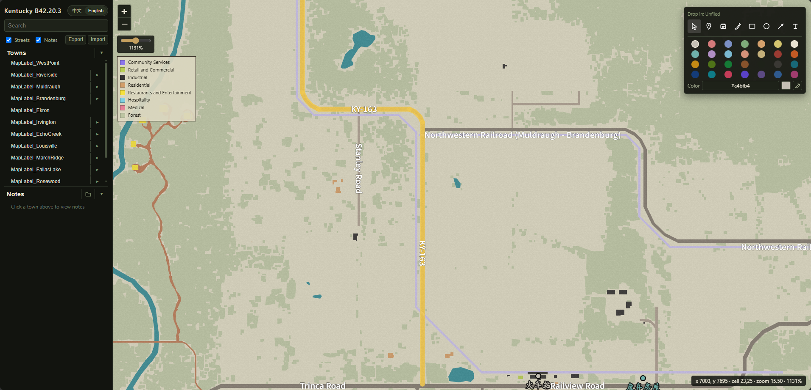
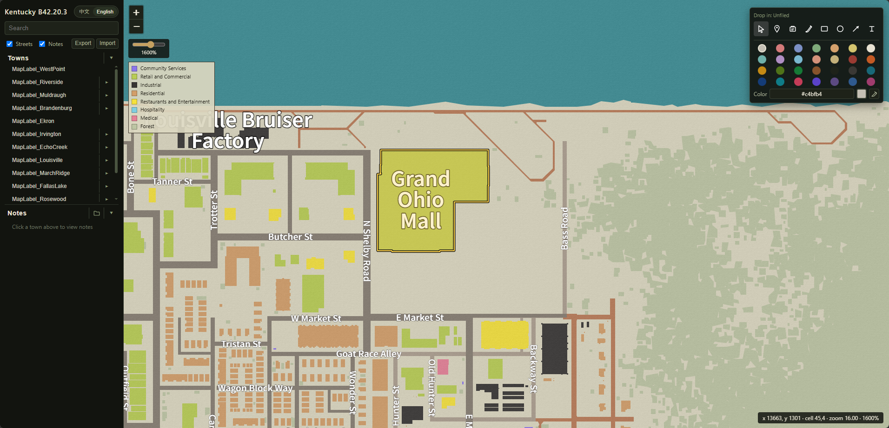

# Project Zomboid 纸质地图

《僵尸毁灭工程》(Project Zomboid) 肯塔基纸质地图网页。可完全本地离线运行。以后可能做移动端，也可能部署到服务器。

本仓库**禁止商业使用**（见 [许可](#许可)）。

## 感谢

中文翻译词键来自以下 Steam Workshop 模组：

- [As1](https://steamcommunity.com/sharedfiles/filedetails/?id=3556544454)「[B42]统一·中文汉化」
- [As1](https://steamcommunity.com/sharedfiles/filedetails/?id=3556540080)「[B42]统一模组汉化」
- [无聊的栀子](https://steamcommunity.com/sharedfiles/filedetails/?id=3448235767)「[B42]Spawn Location_CN 地图出生点简体中文汉化」

## 截图

选中城镇后在地图上落备注，右侧打开详情（标题、图章、说明）：



未点城镇时备注区为空；侧栏可切换中/英文，导入导出 JSON：



鼠标移到道路上高亮该路：



鼠标移到建筑上高亮轮廓：



## 功能

- 导入 / 导出 JSON 备注
- 点状备注、游戏原版图章、矩形 / 圆 / 箭头 / 笔刷、纯文字
- 圆点落在楼内自动绑建筑；也可把圆点拖到楼上绑定
- 复制 / 剪切 / 粘贴到地图坐标（Ctrl+C / X / V），Delete 删除
- 悬停建筑高亮轮廓，悬停道路高亮同名路
- 右键菜单快速添加备注
- 点击备注或已绑定的楼打开详情
- 备注可拖到侧栏城镇（绑楼进「建筑」，否则进「攻略」）；未归档在城镇列表底部「其他」
- 详情里可调整图层顺序

备注存在当前浏览器 `localStorage`，换电脑或清站点数据会丢，请用导入导出备份。

## 启动

1. **玩游戏**：到 [Releases](https://github.com/lz166454-droid/project-zomboid-map/releases) 下载最新的 `PZ纸质地图-*.exe`，双击即可。单文件、不用安装。
2. **从源码运行**（需要 [Node.js](https://nodejs.org/) 18+）：

```bash
git clone https://github.com/lz166454-droid/project-zomboid-map.git
cd project-zomboid-map
pnpm start
```

浏览器打开 [http://127.0.0.1:8765/](http://127.0.0.1:8765/)（只监听本机）。网页模式没有额外 npm 依赖，也可直接 `node app.js`。

自己打 exe：先 `pnpm install`，再 `pnpm dist`，产物在 `dist/PZ纸质地图-<版号>.exe`。

## 使用

给某个城镇的建筑或区域加备注：

1. 在左侧点城镇（未归档点列表底部「其他」）。
2. 右侧工具条选备注类型，在地图上点击要标记的建筑或区域。
3. 弹出的详情里写标题、选图章、写说明。标题会画在地图上。

其它：路名 / 备注可在侧栏勾选显示；点已选中的城镇可退回空备注态。

## 下一步

补充游戏攻略向的备注内容与展示（城镇「攻略」分类已有，后续做攻略模板 / 图文等）。

## 许可

程序源码使用 [PolyForm Noncommercial License 1.0.0](LICENSE)：允许个人学习、修改、非商业分发，**禁止商业使用**。

`app/data/`、`app/static/paper.png`、`app/static/symbols/` 等地图数据、纸纹和图章来自 *Project Zomboid*，版权归 [The Indie Stone](https://projectzomboid.com/) 及其权利人，**不在上述许可范围内**。使用本仓库请自备正版游戏。本项目与 The Indie Stone 无关、非官方。
